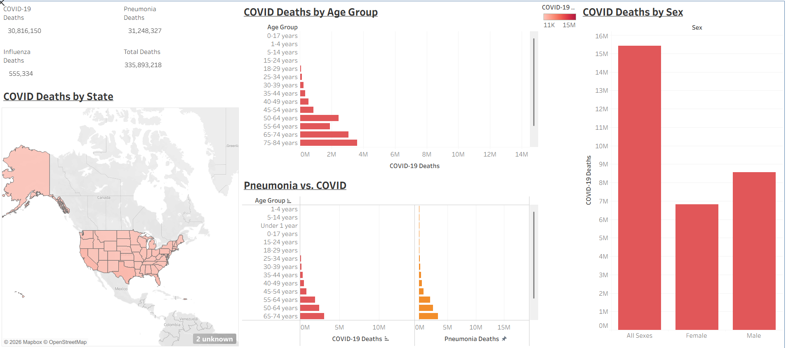
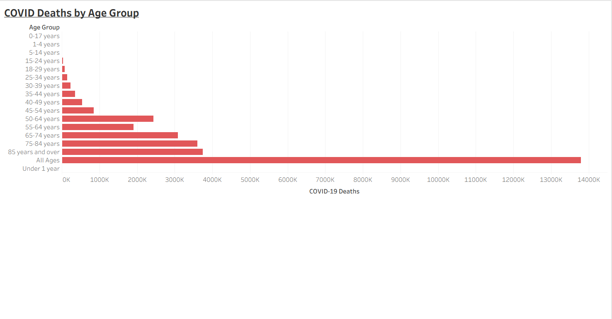
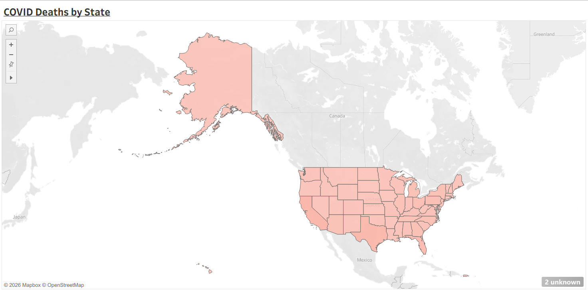

# COVID-19 Mortality Disparities Dashboard: Interactive Tableau Public Health Analysis

## 📊 Project Overview
*COVID-19 has affected populations unevenly across age, sex, and geographic regions, creating a need to better understand mortality disparities for informed public health response.*

This project presents an interactive Tableau dashboard built using CDC Provisional COVID-19 mortality data to analyze demographic and geographic patterns in death rates and identify high-risk populations.

The dashboard enables users to explore mortality trends by age group, sex, state, and time period through dynamic filters and interactive visualizations, supporting exploratory analysis and data-driven public health decision making.

---
## Key Insights
**1. Age was the strongest predictor of mortality risk**, with older age groups experiencing significantly higher COVID-19 death counts compared to younger populations.

**2. Individuals aged 65+ accounted for the majority of deaths**, highlighting the increased vulnerability of elderly populations during the pandemic.

**3. Mortality rates showed noticeable differences between sexes**, with males generally experiencing higher death counts than females across most age groups.

**4. COVID-19 deaths varied significantly by state**, indicating geographic disparities in healthcare access, population density, and public health response effectiveness.

**5. Deaths peaked during specific time periods**, reflecting waves of infection and the evolving impact of the pandemic over time.

---
## 📌 Tools & Skills Demonstrated
Tableau | Excel | CDC Public Health Dataset

Skills: *Data Visualization, Healthcare Analytics, EHR/Clinical Informatics concepts, Public Health Trend Interpretation, Interactive filtering and user experience design*

---

## 📁 Data Source
- CDC Provisional COVID-19 Death Counts Dataset  
- Public health data used for mortality trend analysis
---

## 📈 Key Features
- Interactive filters (State, Sex, Age Group)
- Demographic breakdown of COVID-19 deaths
- Trend analysis over time
- Comparative visualizations across populations
- User-driven exploratory dashboard design

---

## 🏥 Healthcare Impact & Use Case

This dashboard shows how clinical and public health data can be used to support better decision-making during a public health crisis. By turning raw CDC mortality data into an interactive tool, it helps healthcare professionals identify high-risk populations, track disease burden trends, and understand differences in outcomes across age, sex, and geographic regions.

From a clinical informatics perspective, the results support risk stratification, especially for older adult (geriatric) populations, and highlight how key factors like age, sex, and location can influence health outcomes and guide resource allocation.

The differences in mortality rates across states also emphasize the need for localized public health planning, including how hospitals distribute critical resources such as ICU beds, staffing, and vaccination efforts.

This type of dashboard can also be used in Electronic Health Record (EHR) systems and public health reporting tools to improve real-time monitoring, support clinical decision support systems (CDSS), and strengthen awareness during disease outbreaks. Overall, it demonstrates how Tableau can help translate complex public health data into clear, actionable insights for clinical and operational use.

---

## 📷 Screenshots

### Dashboard Overview

### Age Group Analysis

### State-Level Trends

---
## How to View This Project

1. Download the `.twbx` Tableau packaged workbook from this repository  
2. Open it using Tableau Desktop or Tableau Public  
3. Explore the interactive dashboard using filters for age, sex, and state

---

## 👩🏽‍💻 Author
Naomi Agwunobi  
Healthcare Informatics Professional
